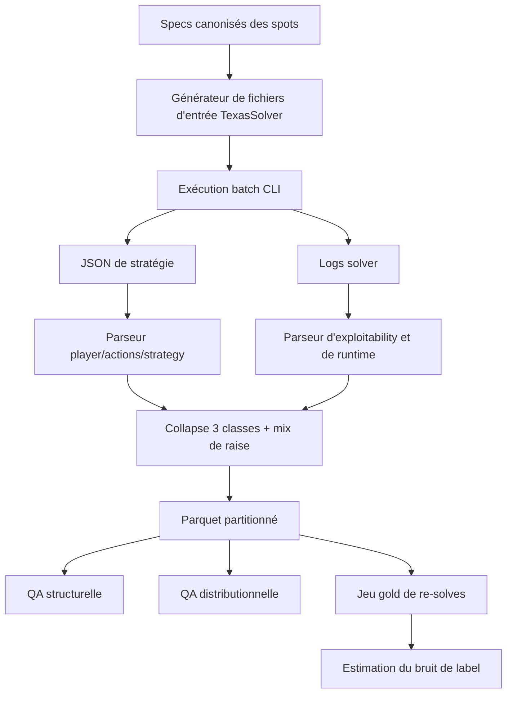
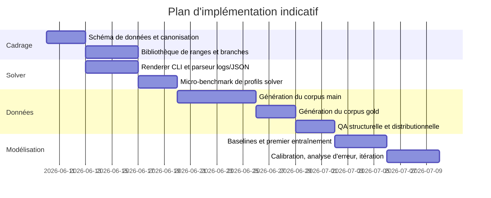

# Faisabilité d’un dataset massif de spots river avec TexasSolver pour entraîner un modèle ML fort en No-Limit Hold’em

> ## STATUS D’IMPLÉMENTATION
>
> Ce rapport sert maintenant de mémoire courte du chantier.
>
> **Terminé** :
>
> - `Traine_aide_decission/river_solver/` est livré : canonisation, génération
>   de spots, runner TexasSolver/simulateur, parser, collapse 3-classes,
>   features V3, writer JSONL/Parquet, QA, pipeline et README.
> - Les tests du pipeline river solver sont en place, avec smoke test validé.
> - Le pipeline V3 slim sait produire et exporter quatre modèles :
>   `preflop`, `flop`, `turn`, `river`.
> - Le mode live `river_solver` ne doit pas lancer TexasSolver en temps réel :
>   il charge un bundle modèle, puis fallback explicitement sur
>   `v3_slim_latest` tant que `river_solver_latest` n’existe pas.
>
> **Validé pendant la stabilisation live/notebook** :
>
> - [x] Corriger le crash live `cannot inherit non-frozen dataclass from a frozen one`
>   dans `aide_decission/objet/services/river_solver_decision.py`.
> - [x] Corriger l’appel invalide à l’engine exporté : utiliser
>   `ExportedModelDecisionEngine(export_dir=...)`.
> - [x] Ajouter des tests live pour l’import river solver, le fallback v3 et la
>   propagation de `raise_amount`.
> - [x] Valider le notebook sur les quatre modèles et garder l’analyse graphique
>   obligatoire : métriques, importances, learning curves, matrices de confusion.
> - [ ] Surveiller le warning de version sklearn lors du chargement de modèles
>   entraînés/exportés avec une autre version que celle de la venv live.
>
> **Garde-fous toujours valides** :
>
> - offline only pour le solveur ;
> - pas de label ML automatique sans QA ;
> - tests ciblés après chaque changement ;
> - pas de refactor massif non validé.

## Résumé exécutif

Oui, il est réaliste de produire un dataset volumineux et utile d’environ 500 000 spots river avec TexasSolver **si** vous cadrez le projet comme un apprentissage **conditionnel de politique river** à partir d’un état richement observé — cartes privées, board, ranges, historique d’actions, tailles autorisées, pot, stack effectif, position et contexte de mise. En revanche, cela ne suffit pas, à lui seul, à construire un agent HUNL complet de niveau recherche : les systèmes de très haut niveau comme DeepStack et Libratus s’appuient sur de la résolution locale, du raisonnement récursif et/ou des blueprints full-game, pas sur une simple imitation supervisée d’un seul street. citeturn40search1turn39search9

Le point clé est la **granularité de solve**. Si vous tentez de générer 500 000 labels en lançant pour chaque spot un solve **full flop-to-river** comparable aux presets postflop larges, la facture de calcul devient rapidement prohibitive : un benchmark open-source indépendant a mesuré TexasSolver v0.2.0 autour de **67,1 s à 182,6 s** par solve sur un preset “3betpotFAST” à 16 threads, avec **2,84 Go** de mémoire, et a même signalé une divergence sur ce preset précis. En revanche, la documentation du projet Java d’origine — à laquelle la doc C++ renvoie pour le format de sortie — indique que des **solves river** se font en **moins d’une seconde** sur le MacBook Pro de l’auteur, et les **solves turn** “généralement en moins de 10 secondes”. La conclusion pratique est simple : **500k spots sont faisables si vous résolvez directement des sous-jeux river ou turn très simplifiés** ; **ils ne le sont pas** si vous repartez d’arbres flop larges pour chaque exemple. citeturn38view0turn15view0turn14view0

TexasSolver est bien positionné pour ce projet parce qu’il est documenté comme un solver **open source**, **cross-platform**, pilotable en **ligne de commande**, capable de **dump la stratégie en JSON**, avec réglages de **threads**, **accuracy**, **isomorphism** et tailles d’actions. Mais il existe encore des zones grises documentaires : le contrat exact du **CLI pour les roots river**, le **schéma JSON complet** et la présence native d’**EV d’action** ne sont pas décrits proprement dans la documentation C++ consultée. Il faut donc traiter certaines parties du pipeline — surtout l’extraction des EV détaillées — comme **à vérifier ou à patcher**. citeturn14view0turn13view2turn15view2

Sur les risques, le principal danger n’est pas tant la génération hors-table du dataset que son **usage en temps réel**. Les opérateurs interdisent explicitement les outils donnant des recommandations live ; PokerStars bannit les outils ou services qui analysent l’état d’une partie en cours pour conseiller l’action, et Winamax indique que certains logiciels donnant un avantage déloyal sont strictement interdits, avec procédure d’autorisation préalable pour les outils d’aide non listés. À cela s’ajoute le risque licence : la branche console de TexasSolver est annoncée sous **GNU AGPL v3**, licence à copyleft fort avec obligations particulières en cas d’usage réseau d’une version modifiée. citeturn19search2turn19search8turn30search1turn30search4turn14view0turn31search2

En synthèse, mon verdict est le suivant : **faisable et pertinent** pour entraîner un **modèle river fort** ; **non recommandé** si votre plan implicite est de construire un agent complet de poker uniquement par imitation de décisions river ; **hautement recommandé** de stocker un dataset **condensé** en format colonne et **pas** les JSON solver bruts, parce que les sorties documentées peuvent aller de quelques kilo-octets à des **dizaines de gigaoctets**. citeturn15view2

## Audit des sources et du dépôt

J’ai commencé par le dépôt demandé, `polo1093/regroupement-live-et-traine`. Le connecteur GitHub via `api_tool` n’était pas exploitable dans le périmètre exposé ici, donc j’ai audité le dépôt public directement sur GitHub Web. Le constat est simple : le dépôt est public, n’a qu’**un commit**, et son contenu utile se limite à un `README.md` d’une ligne — `# regroupement-live-et-traine`. Il n’apporte donc pas, à ce stade, de détails d’implémentation sur la génération de datasets, l’automatisation solver ou le training pipeline. citeturn11view0turn12view0turn13view0

Les sources primaires réellement informatives ont été : la branche **console** de TexasSolver, la documentation du projet Java précédent **TexasHoldemSolverJava**, la documentation officielle de **PioSOLVER**, la documentation officielle de **GTO Wizard**, la licence **GNU AGPL**, ainsi qu’une source open-source comparative, **WASM Postflop**, qui benchmarke TexasSolver sur un preset commun. J’ai utilisé les sources francophones quand elles existaient, surtout pour les aspects contractuels et éthiques liés aux rooms. citeturn13view2turn15view0turn26search0turn26search9turn28view0turn28view1turn31search2turn30search1turn19search2

Côté TexasSolver, la branche console décrit un solver C++ “extremely efficient”, multi-plateforme, supportant les appels cross-language, le **dump de stratégie en JSON**, et mettant en avant une vitesse supérieure à Pio sur certains arbres à 1–2 bets + all-in. La doc donne aussi le pattern de commande central : fichier texte d’input, `build_tree`, réglage du nombre de threads, de l’accuracy, éventuelle isomorphie, puis `start_solve`, `set_dump_rounds` et `dump_result output_result.json`. La même doc annonce la licence **GNU AGPL v3**. citeturn14view0turn13view2

La documentation Java est précieuse parce qu’elle documente davantage les structures de sortie et les cas turn/river. Elle indique que le solver se concentre sur les **situations postflop**, montre explicitement des **test cases turn et river**, dit qu’“en river” le solve prend **moins d’une seconde** et “en turn” **généralement moins de 10 secondes** sur le MacBook Pro de l’auteur, et que le fichier de sortie `output_strategy.json` est lisible et peut varier de **quelques KB à des dizaines de GB**. Cette doc précise également que la sortie contient au moins `player`, `actions` et `strategy`, mais **ne documente pas clairement un bloc EV complet exploitable en batch**. citeturn27view3turn15view0turn15view2

Enfin, le benchmark de WASM Postflop constitue un utile **contrepoids méthodologique**. Sur le preset “3betpotFAST”, son auteur mesure TexasSolver plus lent et plus gourmand que plusieurs alternatives, avec une divergence de solution sur ce test spécifique, tout en ajoutant qu’il ne peut pas vérifier l’EV globale dans TexasSolver. Je le traite donc comme une **alerte pratique**, pas comme une condamnation générale du solver. Cela renforce surtout l’idée qu’il faut **re-benchmarker votre abstraction exacte** et ne pas extrapoler à partir d’un seul arbre. citeturn38view0

## Faisabilité pratique avec TexasSolver

### Ce qui est faisable

Le cœur de votre objectif — apprendre à choisir entre **no_invest**, **call** et **raise** à la river — est un cas favorable pour du supervised learning, parce que la river est le street où l’information observée est la plus riche et où la profondeur d’arbre résiduelle est la plus faible. Si vous fournissez au modèle les **ranges reachées**, l’**historique d’actions**, la **position**, le **pot**, le **to_call**, les **tailles de raise autorisées**, le **stack effectif**, le **format** et les **cartes**, alors le problème devient essentiellement l’approximation d’une **politique solver conditionnelle** sur un état très descriptif. En ce sens, un corpus de 500 000 spots est tout à fait défendable. citeturn15view0turn16view2

TexasSolver est compatible avec cette ambition parce qu’il accepte des ranges pondérées, des boards, des tailles d’actions par street et par position, le seuil all-in, l’isomorphie, le nombre de threads et une accuracy cible, puis exporte un JSON de stratégie. La branche console montre aussi que l’on peut construire des arbres river avec plusieurs tailles de raise, par exemple `set_bet_sizes oop,river,raise,60,100`, ce qui correspond bien à votre besoin de collapse vers une classe unique `raise` tout en conservant les tailles internes pour les labels auxiliaires. citeturn14view0turn8view0

### Ce qui ne l’est pas sans simplification forte

La stratégie qui **ne** passera **pas** à l’échelle consiste à résoudre 500 000 exemples en repartant chaque fois d’un arbre postflop suffisamment large pour traverser flop, turn et river. Les chiffres dont on dispose sont trop parlants : sur le benchmark “3betpotFAST” de WASM Postflop, TexasSolver prend **67,1 s à 182,6 s** par solve à 16 threads ; même la doc C++ officielle ne donne comme benchmark publié qu’un **solve flop** à **172 s** avec **6 threads** et **1,6 Go**. À ce rythme, 500 000 solves sérialisés par machine représentent plusieurs **centaines de jours**, voire davantage. citeturn38view0turn14view0

En d’autres termes, **500k river spots sont faisables**, mais **500k full solves postflop larges ne le sont pas** dans un pipeline standard. Votre projet passe donc par l’une des trois options suivantes : résoudre **directement en river**, résoudre **directement en turn** avec un arbre river compact, ou bien préconstruire un nombre limité d’arbres mères et extraire ensuite un grand nombre de nœuds river. La documentation actuelle laisse entendre que des cas turn/river existent, surtout via le projet Java, mais le contrat exact du **CLI C++ sur un root river** reste **insuffisamment spécifié** dans les docs consultées. citeturn27view3turn15view0turn13view2

### Risques licence, juridiques et éthiques

Sur la licence, la branche console de TexasSolver annonce **GNU AGPL v3**. La Free Software Foundation rappelle que l’AGPL est une licence copyleft conçue pour les logiciels utilisés sur réseau et que l’exploitation d’une **version modifiée** sur un serveur public déclenche des obligations de mise à disposition du code correspondant aux utilisateurs de ce serveur. Si vous générez simplement vos données en interne, le risque est faible ; si vous transformez votre pipeline en **service SaaS** de résolution ou d’annotation, la revue juridique devient indispensable. citeturn14view0turn31search2

Sur l’usage poker, les risques identifiables dans les sources consultées sont surtout **contractuels et éthiques**. PokerStars interdit les outils ou services donnant des conseils en temps réel sur l’action à entreprendre en analysant l’état de la partie ; Winamax précise que certains logiciels procurant un avantage déloyal sont strictement interdits et qu’un logiciel d’aide non listé doit être validé au préalable par l’intégrité du jeu. PokerStars précise aussi que les outils solver sont destinés à l’étude **hors-table** et ne doivent pas être utilisés en temps réel pendant qu’on joue. Donc, **produire un dataset hors ligne** est une chose ; **déployer ensuite un assistant live** en est une autre, et cette seconde voie entre clairement en zone interdite chez les opérateurs. citeturn19search2turn19search8turn19search21turn30search1turn30search4

### Limites solveur à poser noir sur blanc

Vous devez considérer plusieurs limites comme des **hypothèses à valider** avant d’industrialiser le pipeline. D’abord, le périmètre documenté est essentiellement **heads-up postflop** ; la doc Java parle explicitement de check-limit “dans le hold’em à 2 joueurs”, et la doc générale positionne le projet sur le postflop. Ensuite, la documentation consultée **ne spécifie pas clairement** les paramètres de **rake**, d’**ICM**, ni un schéma JSON stable pour les **EV d’actions**. Enfin, la qualité des labels dépend fortement de la **qualité des ranges d’entrée** : un modèle ML river apprendra très bien à imiter une politique solver **conditionnée sur de bonnes ranges**, mais il généralisera mal si ces ranges sont artificielles ou incohérentes avec l’historique. citeturn27view0turn27view3turn15view2

## Schéma de données recommandé

Je recommande une granularité **une ligne = un spot river pour un joueur à agir**, avec, en plus, des colonnes auxiliaires permettant soit un training tabulaire/transformer directement, soit une conversion rapide en tenseurs. Le plus important est de **séparer** les **features de contexte**, les **features de ranges**, les **masques d’actions légales**, les **labels 3-classes**, et les **métadonnées de solve**.

### Contexte du spot

| Champ | Type recommandé | Obligatoire | Commentaire |
|---|---:|---:|---|
| `dataset_version` | string | oui | Version sémantique du corpus |
| `spot_id` | string | oui | ID déterministe, par ex. hash du spot canonique |
| `solve_run_id` | string | oui | Identifiant de la campagne solver |
| `solver_name` | string | oui | `TexasSolver` |
| `solver_version` | string | oui | Version exacte du binaire |
| `street` | enum | oui | Toujours `river` dans ce corpus |
| `format` | enum | oui | Ex. `cash_hu_nlhe` |
| `rake_pct` | float | nullable | À renseigner si supporté ; sinon `null` |
| `rake_cap_bb` | float | nullable | Idem |
| `small_blind` | float | oui | En BB ou en monnaie native, mais cohérent |
| `big_blind` | float | oui | Souvent 1.0 si normalisé |
| `ante` | float | oui | 0 si absent |
| `pot_before_action` | float | oui | Pot au début du nœud |
| `to_call` | float | oui | Montant à payer pour call |
| `effective_stack_remaining` | float | oui | Stack effectif restant au nœud |
| `hero_stack_remaining` | float | oui | Stack joueur à agir |
| `villain_stack_remaining` | float | oui | Stack adverse |
| `position_to_act` | enum | oui | `ip` / `oop` |
| `facing_bet_flag` | bool | oui | Disambiguïse `no_invest` |
| `board_flop` | string | oui | `QsJh2h` par exemple |
| `board_turn` | string | oui | Carte turn |
| `board_river` | string | oui | Carte river |
| `board_full` | string | oui | Board complet canonisé |
| `private_cards_hero` | string | oui | Combo exact, ex. `AhKd` |
| `private_cards_villain` | nullable string | non | Souvent inconnu au training ; garder vide si modèle policy conditionnée sur ranges |
| `node_path` | string | oui | Historique canonique, ex. `flop:bet33/call;turn:x/x;river:?` |
| `branch_type` | enum | oui | `srp`, `3bet`, `4bet`, etc. |
| `spr_at_street_start` | float | oui | SPR à l’entrée du street |

Les champs structurants correspondent à ce que TexasSolver expose ou paramètre explicitement via `set_pot`, `set_effective_stack`, `set_board`, `set_range_*`, `set_bet_sizes`, `set_thread_num`, `set_accuracy`, `set_use_isomorphism`, `dump_result`, ainsi qu’aux structures de sortie au moins documentées dans le projet Java autour de `player`, `actions` et `strategy`. citeturn14view0turn15view2

### Ranges, abstraction d’actions et information de nœud

| Champ | Type recommandé | Obligatoire | Commentaire |
|---|---:|---:|---|
| `hero_range_1326` | array<float16> | oui | Dense 1326 ou sparse ; dense float16 est souvent le meilleur compromis |
| `villain_range_1326` | array<float16> | oui | Même format |
| `hero_range_mass` | float | oui | Somme des poids après card removal |
| `villain_range_mass` | float | oui | Idem |
| `hero_range_source` | string | oui | `library`, `perturbed_library`, `handover`, etc. |
| `villain_range_source` | string | oui | Idem |
| `allowed_no_invest` | bool | oui | Toujours vrai, mais sens check/fold via `to_call` |
| `allowed_call` | bool | oui | Faux si `to_call == 0` |
| `allowed_raise` | bool | oui | Faux si all-in effectif ou arbre sans raise |
| `raise_options_abs` | array<float32> | oui | Montants absolus autorisés |
| `raise_options_pct_pot` | array<float32> | oui | Normalisation en % pot |
| `allin_allowed` | bool | oui | Uitile en feature |
| `raw_actions` | array<string> | oui | Ex. `["CHECK","BET 4.0","BET 8.0","ALLIN"]` |
| `raw_action_count` | int | oui | Nombre d’actions natives au nœud |
| `canonical_board_id` | string | oui | ID après réduction de symétrie |
| `canonical_range_id` | string | oui | Hash des ranges canonisées |
| `isomorphism_used` | bool | oui | Repris du solve |
| `solver_node_id` | nullable string | non | Si le JSON natif donne un identifiant exploitable |
| `solver_tree_id` | string | oui | Référence au solve brut source |

La doc Pio fait explicitement référence au calcul d’agrégats sur les **1 755 flops stratégiquement différents** et avertit que des **ranges non symétriques** rendent l’arbre plus gros et plus lent. Même si cela concerne ici un autre solver et un autre street, c’est une excellente justification méthodologique pour imposer une **canonisation** et une **symétrisation** strictes sur vos spots avant de résoudre. TexasSolver, de son côté, expose bien un flag `set_use_isomorphism 1`. citeturn29view0turn14view0

### Labels, EVs et métriques de qualité

| Champ | Type recommandé | Obligatoire | Commentaire |
|---|---:|---:|---|
| `freq_no_invest` | float32 | oui | Probabilité de check si `to_call=0`, sinon de fold |
| `freq_call` | float32 | oui | 0 si call illégal |
| `freq_raise` | float32 | oui | Somme des fréquences de toutes les tailles agressives |
| `hard_label_3class` | enum | oui | Argmax des trois fréquences ou règle custom avec seuil |
| `raise_mix_by_size` | json / map | oui | Distribution conditionnelle sur les tailles de raise |
| `raise_best_size` | nullable float32 | non | Taille au meilleur EV si EV disponible |
| `ev_no_invest` | nullable float32 | fortement recommandé | EV conditionnelle de la classe |
| `ev_call` | nullable float32 | fortement recommandé | EV conditionnelle de la classe |
| `ev_raise_conditional` | nullable float32 | fortement recommandé | EV moyenne conditionnelle du bloc `raise` |
| `ev_raise_mass` | nullable float32 | utile | \( \sum_i p_i \cdot EV_i \) sur les sizes agressives |
| `ev_gap_best_vs_mapped` | nullable float32 | utile | Coût de collapse vers 3 classes |
| `root_exploitability_pct` | float32 | oui | Tiré des logs solver |
| `player0_exploitability` | nullable float32 | utile | Idem |
| `player1_exploitability` | nullable float32 | utile | Idem |
| `solve_accuracy_target` | float32 | oui | Paramètre d’input |
| `max_iteration` | int | oui | Paramètre d’input |
| `iterations_reached` | nullable int | utile | Si parsable dans le log |
| `time_used_sec` | nullable float32 | utile | Parsé du log |
| `json_dump_bytes` | nullable int64 | utile | Mesure de taille de sortie |
| `qa_status` | enum | oui | `ok`, `warning`, `failed`, `resolve_required` |

Le point sensible tient aux **EV d’actions**. Les docs consultées garantissent bien des **stratégies** en sortie, mais ne documentent pas clairement un bloc EV standardisé prêt à être parsé dans le JSON C++. Comme vous avez demandé les EVs dans le schéma, je les recommande comme **colonnes de premier rang**, mais **nullable** tant que vous n’avez pas vérifié votre build ou patché le code pour les exporter proprement. La sortie documentée montre au minimum des fréquences par action et des métriques d’exploitabilité dans les logs ; les EV détaillées doivent être considérées comme **à confirmer techniquement**. citeturn15view2turn14view0turn38view0

## Génération des spots et pipeline d’automatisation

### Stratégie de génération pour atteindre environ 500k spots

La bonne stratégie n’est pas de tirer 500 000 boards totalement indépendants au hasard. La bonne stratégie consiste à construire un corpus **stratifié**, avec une couche “production” large et une couche “gold” plus coûteuse.

Je recommande une structure du type suivant :

| Tranche | Volume cible | Objectif |
|---|---:|---|
| `main_medium` | 450 000 | Couverture large, accuracy medium |
| `gold_high` | 25 000 | Re-solves plus précis pour QA et calibration |
| `ood_stress` | 25 000 | Overbets, all-ins, ranges perturbées, textures rares |

Pour peupler ces 500 000 lignes, il faut stratifier par **type de branche préflop** et **géométrie du pot**, puis, à l’intérieur, par **textures de board** et **familles de ranges**. Une répartition raisonnable pour un produit orienté cash-game heads-up postflop serait de viser environ **40–50 % SRP**, **30–40 % 3-bet pots**, **5–15 % 4-bet pots**, et le reste en cas de figure plus rares mais pédagogiquement utiles. Je recommande ensuite de sur-échantillonner légèrement les spots où le solver mélange réellement entre vos trois classes, parce que ce sont eux qui portent le plus d’information d’apprentissage.

La génération des boards doit intégrer une **réduction de symétrie**. Vous n’avez pas besoin de mémoriser tous les boards équivalents par permutation de couleurs. Canonisez les suits, appliquez le card-removal, et évitez les doublons stratégiques. La documentation Pio sur les flops stratégiquement différents et l’avertissement sur les ranges asymétriques montrent bien l’intérêt opérationnel de cette discipline ; TexasSolver expose en plus un flag d’isomorphie, ce qui va dans le même sens. citeturn29view0turn14view0

Concernant les ranges, je déconseille de partir uniquement de ranges “parfaites” ultra-propres. Pour un modèle robuste, il faut au minimum trois régimes : des ranges **bibliothèque** fidèles à vos branches standard, des ranges **légèrement perturbées** pour gagner en robustesse, et une petite fraction de ranges **stressées** pour tester la stabilité hors distribution. En pratique, les perturbations doivent rester **structurées par familles de combos** et **symétriques** pour ne pas détruire les optimisations du solveur.

Enfin, la “pruning equity” doit être utilisée avec précision. À la river, vous pouvez et devez pruner les combos **impossibles** ou **de reach quasi nulle**, mais je déconseille de pruner agressivement les combos simplement parce qu’ils sont faibles en showdown : vous risqueriez d’effacer des no-invest ou des raises-bluffs rares mais très informatifs.

### Règles de collapse vers la classe unique `raise`

Le collapse ne doit **jamais** jeter l’information de taille. Il faut séparer la **classe d’action** de la **distribution interne de sizing**.

Soit les actions natives agressives \( r_1, r_2, \dots, r_k \), avec fréquences \( p_i \) et EV \( e_i \).

Je recommande de dériver les colonnes suivantes :

\[
f_{\text{raise}} = \sum_{i=1}^{k} p_i
\]

\[
EV_{\text{raise,conditional}} =
\frac{\sum_{i=1}^{k} p_i e_i}{\max(f_{\text{raise}}, \varepsilon)}
\]

\[
EV_{\text{raise,mass}} = \sum_{i=1}^{k} p_i e_i
\]

et, en plus,

\[
\text{raise\_mix\_by\_size}[i] = \frac{p_i}{\max(f_{\text{raise}}, \varepsilon)}
\]

avec `best_raise_size = argmax_i(e_i)` quand les EV sont disponibles.

La classe `no_invest` doit être définie **sémantiquement** :

- si `to_call == 0`, `no_invest = check` ;
- si `to_call > 0`, `no_invest = fold`.

C’est pourquoi `to_call` et `facing_bet_flag` sont des **features obligatoires**. Sans elles, votre target 3-classes serait ambiguë.

En training, je recommande donc de superviser **à la fois** :
- la distribution 3-classes `(no_invest, call, raise)` ;
- la distribution conditionnelle `raise_mix_by_size` ;
- et, si possible, les EVs de classes.

### Pipeline d’automatisation



Le pipeline concret que je donnerais à Codex est le suivant.

**Étape de spécification.** Produire un fichier source `spot_specs.parquet` contenant tous les spots canonisés avant solve. À ce stade, chaque ligne contient déjà le board, les ranges, la position, le pot, les stacks, l’historique, les tailles autorisées et les métadonnées de sampling.

**Étape de rendu CLI.** Pour chaque ligne, générer un fichier texte solvable par TexasSolver. Le pattern minimal documenté ressemble à ceci : citeturn14view0turn8view0

```bash
set_pot 50
set_effective_stack 200
set_board Qs,Jh,2h,7c,2d
set_range_ip AA,KK,QQ:0.5,AKs,AQo,...
set_range_oop TT,99,88,AJs,A5s,...
set_bet_sizes oop,river,bet,50
set_bet_sizes oop,river,raise,60,100
set_bet_sizes oop,river,allin
set_bet_sizes ip,river,bet,50
set_bet_sizes ip,river,raise,60,100
set_bet_sizes ip,river,allin
set_allin_threshold 0.67
build_tree
set_thread_num 1
set_accuracy 0.2
set_max_iteration 200
set_print_interval 25
set_use_isomorphism 1
start_solve
set_dump_rounds 1
dump_result output_result.json
```

**Hypothèse explicite** : l’acceptation directe d’un board à 5 cartes dans le CLI C++ doit être testée sur votre build. La doc Java montre des cas turn/river, mais la doc console C++ consultée ne documente pas exhaustivement cette syntaxe. Si cela échoue, le fallback est de poser un root **turn** et de générer le river dans un arbre très compact. citeturn27view3turn14view0

**Étape d’exécution batch.** Pour les roots river légers, imposez `set_thread_num 1` et parallélisez par **grand nombre de processus**, pas par solve multi-thread lourd. Pour les turns plus gros, passez à `2–4` threads par solve et réduisez `-j`. La doc officielle met explicitement en avant le réglage des threads, et Pio rappelle de manière générale que la performance dépend avant tout du couple **cœurs physiques × fréquence**. citeturn14view0turn26search0

Exemple Bash :

```bash
mkdir -p logs json failed

parallel \
  --joblog logs/joblog.tsv \
  --results logs/results \
  --retries 2 \
  --timeout 600 \
  -j 16 \
  './console_solver -i {1} > logs/{/.}.log 2>&1 || echo {1} >> failed/failed_inputs.txt' \
  ::: inputs/*.txt
```

**Étape de parsing.** Le parseur doit supposer au minimum l’existence des clés documentées `player`, `actions`, `strategy`, et traiter le reste comme optionnel. La doc Java confirme au moins ces trois niveaux de lecture. citeturn15view2

Pseudo-code Python :

```python
def parse_solver_output(json_path: str, log_path: str, spec: dict) -> dict:
    doc = load_json(json_path)

    player = doc["player"]
    actions = doc["actions"]          # liste native des actions
    strategy = doc["strategy"]        # mapping combo -> probas par action

    # Champs optionnels selon build / patch
    ev_block = doc.get("ev") or doc.get("action_ev") or None
    node_id = doc.get("node_id")

    log_info = parse_log_file(log_path)  # exploitability, iterations, time_used_sec

    row = build_condensed_row(
        spec=spec,
        player=player,
        actions=actions,
        strategy=strategy,
        ev_block=ev_block,
        node_id=node_id,
        log_info=log_info,
    )
    return row
```

**Étape d’erreur et reprise.** Les erreurs à traiter en premier sont : timeout, JSON vide, somme des fréquences hors tolérance, action set illégal au regard de `to_call`, output trop volumineux, ou exploitability trop haute. Les spots échoués doivent être re-queue avec un profil plus conservateur : plus d’itérations, moins de tailles, ou solve au street précédent.

## Stockage, validation et coûts

### Format de stockage recommandé

Le mauvais choix serait de stocker 500 000 JSON solver bruts. La documentation indique que les sorties peuvent aller de **quelques KB à des dizaines de GB**, et cela suffit à exclure leur conservation systématique à grande échelle. Le bon choix est un **stockage en deux couches** : un **lake de lignes condensées** pour l’entraînement, et un **échantillon brut** pour audit et reproduction. citeturn15view2

Je recommande :

- **Corpus principal** en **Parquet** avec compression **Zstandard**.
- Partitions par `street=river / format / branch_type / position_to_act / split`.
- Row groups de **128 à 512 Mo** pour garder de bonnes performances en lecture séquentielle.
- Un `manifest.parquet` séparé contenant versions, hashes, nombre de lignes, solve profile et distribution des partitions.
- Un petit **échantillon brut** de JSON + logs, par exemple **0,5 à 1 %** des solves, pour forensics.

Exemple d’arborescence :

```text
dataset/
  version=v1/
    manifest.parquet
    street=river/
      format=cash_hu_nlhe/
        branch_type=srp/
          position_to_act=ip/
            split=train/part-0000.parquet
            split=valid/part-0001.parquet
        branch_type=3bet/
          position_to_act=oop/
            split=train/part-0002.parquet
  raw_audit_sample/
    solve_run_id=2026-06-10/
      *.json
      *.log
      *.input.txt
```

### Tests QA indispensables

La QA doit être pensée comme une **double barrière**.

La première barrière est **structurelle**. Chaque ligne doit valider : unicité des cartes, cohérence `pot/to_call/stacks`, ranges sans cartes mortes, somme des fréquences proche de 1, actions légales compatibles avec `to_call` et le masque d’actions, et présence des métadonnées de solve. Les avertissements Pio sur les ranges non symétriques et les arbres incomplets illustrent bien que les solveurs postflop sont sensibles à ce type d’incohérences. citeturn29view0

La seconde barrière est **distributionnelle et noise-aware**. Vous devez vérifier la couverture des boards, des SPR, des branches préflop, des types de textures et des tailles de mise. Le signal le plus important pour estimer le **bruit de label** est un **jeu gold** re-solvé avec une accuracy plus stricte. La doc Java considère qu’une exploitability **< 0,5** est généralement suffisante pour servir de stratégie optimale approximative ; vous pouvez donc utiliser cela comme seuil de service minimum, puis resoudre un sous-ensemble plus bas encore pour mesurer les flips de classe et la divergence des fréquences. citeturn15view2

Je recommande trois métriques de bruit :

| Mesure | Définition | Usage |
|---|---|---|
| `class_flip_rate` | % de lignes où l’argmax 3-classes change entre solve medium et gold | Détecter les zones fragiles |
| `tv_distance_3class` | Distance de variation totale entre distributions 3-classes | Mesurer la stabilité soft |
| `raise_mix_jsd` | Jensen-Shannon sur le mix des tailles de raise | Savoir si le collapse cache trop d’instabilité |

### Estimation de calcul et de coût

Le tableau ci-dessous mélange **faits sourcés** et **estimations d’ingénierie**. Les temps “optimiste” et “prudent” supposent des roots **river ou turn compacts** et une parallélisation adéquate. Le scénario “flop-style large” est, lui, directement ancré dans les benchmarks publics consultés. Les coûts cloud utilisent comme repère officiel **GCP c4-highcpu-16 à 0,680416 $/h** avec **32 GiB** et un disque standard où **200 Go coûtent 8 $/mois** ; pour AWS, la doc consultée confirme le mode **on-demand** et **gp3 à 0,08 $/Go-mois**, mais sans exposer proprement dans le parsing la grille d’instance complète. citeturn22search1turn22search2turn23search1turn23search2

| Scénario | Hypothèse de solve | Temps pour 500k spots | Coût compute sur c4-highcpu-16 | Verdict |
|---|---|---:|---:|---|
| `river_optimiste` | ~1 s/spot, 16 workers mono-thread | ~8,7 h | ~6 $ | Faisable |
| `river_prudent` | ~5 s/spot, 16 workers mono-thread | ~43 h | ~29 $ | Faisable |
| `turn_compact` | ~10 s/spot, 16 workers mono-thread/bi-thread mixés | ~87 h | ~59 $ | Faisable avec marge |
| `flop_style_large` | 67,1–182,6 s/spot sur preset large 16 threads | ~388 à ~1 056 jours | hors de portée raisonnable | À éviter |

Ces chiffres bruts doivent être majorés par un facteur **x2 à x4** pour couvrir les re-solves, retries, logs, parsing, saturation disque et tuning d’accuracy. Dans un plan réaliste, je budgéterais donc :

- **poste local CPU** : 16 à 32 cœurs, **64 Go RAM**, SSD NVMe ; confortable pour du river batch et du turn compact ;
- **cloud CPU** : 1 à 4 machines de classe 16 vCPU / 32 Go pour accélérer la campagne principale ;
- **stockage** : quelques **Go à dizaines de Go** pour le corpus condensé ; **ne pas** conserver le brut complet ;
- **GPU** : inutile pour la branche CPU standard, mais pertinent si vous basculez vers **TexasSolver GPU**, sachant qu’il demande **Windows + NVIDIA** et que le moteur n’est **pas open source**. citeturn26search0turn35view1turn35view2

## Objectifs d’entraînement et comparaison des solveurs

### Cibles d’entraînement recommandées

Si vous ne deviez retenir qu’un design de target, je recommanderais un modèle **multi-tâches**.

La tête principale prédit les **fréquences soft 3-classes** :
\[
\hat{p} = (\hat{p}_{no\_invest}, \hat{p}_{call}, \hat{p}_{raise})
\]

Une seconde tête prédit `raise_mix_by_size`, c’est-à-dire la distribution conditionnelle entre les tailles agressives quand `raise` est choisi. Une troisième tête, si vous avez les colonnes, prédit les **EVs de classes**. Cela vous permet de garder une interface finale simple à trois boutons tout en préservant la finesse stratégique. C’est le meilleur compromis entre fidélité solver et simplicité produit.

Je déconseille un apprentissage **hard-label only** comme cible unique. Les solveurs postflop sont précisément utiles parce qu’ils produisent des **fréquences mixtes**, des **EVs** et des informations d’**exploitability** ; réduire tout cela à un argmax unique transforme beaucoup de quasi-indifférences en bruit discret. La documentation Pio renvoie explicitement à l’importance des notions de **EV**, **EQ** et **frequencies** pour comprendre les sorties solver. citeturn26search7turn15view2

Une formulation de loss robuste est :

\[
L = \lambda_{policy} \cdot KL(p \,\|\, \hat{p})
+ \lambda_{ev} \cdot \text{Huber}(EV, \hat{EV})
+ \lambda_{raise} \cdot KL(m \,\|\, \hat{m})
+ \lambda_{mask} \cdot L_{legal}
\]

où :
- \(p\) = distribution 3-classes cible,
- \(EV\) = vecteur d’EV de classes si disponible,
- \(m\) = distribution conditionnelle des tailles de raise,
- \(L_{legal}\) = pénalité sur actions illégales prédites.

Je pondérerais ensuite chaque exemple par une combinaison de :
- la **masse de reach** du spot ;
- l’**exploitability** du solve ;
- et un coefficient de difficulté basé sur l’entropie de la politique.

### Tableau comparatif des alternatives

Le tableau suivant distingue les propriétés **facticement sourcées** des colonnes d’**appréciation** qui sont mon analyse.

| Outil | Périmètre documenté | Automatisation | Licence / modèle | Avantages pour votre use case | Limites pour votre use case |
|---|---|---|---|---|---|
| **TexasSolver CPU** | Solver C++ open source postflop, CLI, dump JSON, Windows/Mac/Linux | Fichier texte + CLI | **AGPL-3.0** | Gratuit, scriptable, source modifiable, bon fit si vous gardez la main sur le pipeline | Docs incomplètes sur roots river et EV export ; prudence sur les benchmarks |
| **TexasSolver GPU** | Desktop Windows GPU, batch solve, node-lock, viewer | Orienté appli desktop | **Binaire distribué + EULA**, moteur privé | Potentiel énorme gain de débit local | Windows + NVIDIA ; moteur non publié ; moins approprié si vous voulez patcher l’export |
| **PioSOLVER Pro / Edge** | Solver commercial mature, UPI texte, Pro jusqu’à 16 threads, Edge avec preflop | Très bon niveau d’automatisation | **Propriétaire**, licence perpétuelle ; business license séparée | Documentation mature, interface scripting stable, excellent pour production | Coût, Windows 64-bit, obligations particulières si web/API |
| **WASM Postflop / Desktop Postflop** | Solver open source browser/desktop | Possible, mais moins “batch industry” | **AGPL-3.0** | Ouvert, benchmarks publics, alternative intéressante à tester | Développement suspendu depuis 2023 |
| **noambrown/poker_solver** | **River subgame solver** open source, CFR/CFR+/DCFR, Python ref + C++ perf | Très patchable | **MIT** | Très bon plan B si votre besoin est strictement river | Pas un pipeline full postflop complet |
| **GTO Wizard AI** | Solving custom hébergé, benchmark/API, web-based | API et plateforme hébergée | **Service propriétaire / abonnement** | Très rapide pour explorer, benchmark officiel, custom solving | Contrôle et export locaux moindres ; dépendance service |

Les éléments factuels du tableau proviennent des docs et dépôts officiels consultés : TexasSolver branch console, TexasSolverGPU, PioSOLVER FAQ et product comparison, WASM Postflop, `noambrown/poker_solver`, ainsi que la documentation GTO Wizard sur le custom solving, le benchmark API et l’abonnement. citeturn14view0turn35view1turn26search9turn26search6turn26search4turn37view0turn38view0turn36search0turn28view0turn28view1turn34search0turn34search4

Mon conseil pratique est net :

- **Choix par défaut** : **TexasSolver CPU** si vous tenez à l’open source et au contrôle total du pipeline.
- **Choix “production river pur”** : basculer vers **noambrown/poker_solver** si TexasSolver ne documente pas proprement les roots river et les EVs exportées.
- **Choix “productivité immédiate”** : **PioSOLVER** si vous acceptez le propriétaire et voulez un environnement mature de scripting.
- **Choix “débit local maximal”** : **TexasSolver GPU**, en assumant le compromis closed-source.

## Plan concret pour Codex

Voici le plan que vous pouvez donner tel quel à Codex.

### Feuille de route opérationnelle

1. **Créer le schéma canonique des specs**  
   Définir `spot_specs.parquet` avec toutes les colonnes de contexte, ranges, abstraction d’actions et métadonnées de sampling. Interdire toute génération solver avant validation structurelle des specs.

2. **Écrire le canoniseur**  
   Implémenter :
   - canonisation de suits du board ;
   - suppression des cartes mortes des ranges ;
   - tri déterministe des chemins d’action ;
   - `spot_id = sha1(canonical_json)`.

3. **Construire la bibliothèque de branches et ranges**  
   Créer une librairie YAML/JSON de branches cibles (`srp`, `3bet`, `4bet`) avec ranges hero/villain. Générer ensuite des variantes par perturbation contrôlée de familles de combos.

4. **Écrire le renderer CLI TexasSolver**  
   Prendre une ligne de `spot_specs.parquet` et produire un `.input.txt` solver-compatible, plus un fichier `.meta.json` frère avec les métadonnées d’origine.

5. **Benchmarker avant toute campagne massive**  
   Lancer 100 à 1 000 spots par profil :
   - river direct si le build l’accepte ;
   - turn compact en fallback ;
   - 1 thread par spot vs 2–4 threads par spot ;
   - accuracy 0.3 / 0.2 / 0.1.  
   Sortie attendue : tableau temps/spot, taille JSON, taux d’échec, flip-rate de classe entre profils.

6. **Industrialiser l’exécution batch**  
   Utiliser `GNU parallel` ou un orchestrateur Python. Les jobs doivent être idempotents, timeoutés, retryables, avec un `joblog.tsv`.

7. **Implémenter le parseur JSON/logs**  
   Parser `player`, `actions`, `strategy`, puis :
   - collapse 3-classes ;
   - `raise_mix_by_size` ;
   - parsing d’exploitability, itérations et temps depuis les logs ;
   - EVs en option si présentes.

8. **Assembler les Parquet de training**  
   Écrire des shards partitionnés, plus un `manifest.parquet`. Garder un échantillon brut d’audit.

9. **Lancer la QA en deux passes**  
   Passe A : structure.  
   Passe B : distribution + gold re-solves + estimation de bruit.

10. **Produire les datasets ML**  
    Exporter :
    - `train.parquet`, `valid.parquet`, `test.parquet` ;
    - `gold_valid.parquet` ;
    - `ood_test.parquet`.

11. **Entraîner un premier modèle multitâche**  
    Features riches, policy soft 3-classes, mix de raise, EVs si disponibles, masques d’actions légales.

12. **Comparer aux baselines**  
    Baselines :
    - argmax heuristique pot-odds ;
    - hard-label solver ;
    - soft-label solver simple MLP ;
    - modèle multitâche complet.

### Exemple de structure de configuration

```yaml
dataset:
  version: v1
  target_street: river
  format: cash_hu_nlhe
  normalization:
    big_blind: 1.0
  partitions:
    - branch_type
    - position_to_act
    - split

sampling:
  total_spots: 500000
  splits:
    train: 0.94
    valid: 0.03
    test: 0.03
  strata:
    srp: 0.45
    3bet: 0.35
    4bet: 0.10
    stress: 0.10
  gold_subset: 25000

solver:
  engine: TexasSolver
  profile: river_compact
  thread_num: 1
  accuracy: 0.2
  max_iteration: 200
  print_interval: 25
  use_isomorphism: true
  dump_rounds: 1
  timeout_sec: 600

actions:
  map_to_3class: true
  no_invest_semantics:
    if_to_call_zero: check
    else: fold
```

### Exemple minimal de runner Python

```python
from __future__ import annotations

import json
import subprocess
import time
from pathlib import Path

def run_texassolver(binary: str, input_file: Path, timeout_sec: int = 600) -> dict:
    start = time.time()
    proc = subprocess.run(
        [binary, "-i", str(input_file)],
        capture_output=True,
        text=True,
        timeout=timeout_sec,
        check=False,
    )
    elapsed = time.time() - start

    result = {
        "returncode": proc.returncode,
        "elapsed_sec": elapsed,
        "stdout": proc.stdout,
        "stderr": proc.stderr,
    }

    if proc.returncode != 0:
        raise RuntimeError(f"solver_failed: {input_file} rc={proc.returncode}")

    return result

def parse_log_text(log_text: str) -> dict:
    out = {
        "player0_exploitability": None,
        "player1_exploitability": None,
        "root_exploitability_pct": None,
        "time_used_sec": None,
    }
    for line in log_text.splitlines():
        s = line.strip().lower()
        if "player 0 exploitability" in s:
            out["player0_exploitability"] = float(s.split()[-1])
        elif "player 1 exploitability" in s:
            out["player1_exploitability"] = float(s.split()[-1])
        elif "total exploitability" in s:
            # format docs: "Total exploitability 17.775038 precent"
            toks = s.split()
            for i, tok in enumerate(toks):
                if tok == "exploitability" and i + 1 < len(toks):
                    out["root_exploitability_pct"] = float(toks[i + 1])
                    break
        elif "time used:" in s:
            out["time_used_sec"] = float(s.split(":")[-1].strip())
    return out

def collapse_raise(raw_actions, probs, evs=None):
    freq_no_invest = 0.0
    freq_call = 0.0
    freq_raise = 0.0
    raise_items = []

    for idx, action in enumerate(raw_actions):
        a = action.upper()
        p = float(probs[idx])
        e = None if evs is None else float(evs[idx])

        if a.startswith("CHECK") or a.startswith("FOLD"):
            freq_no_invest += p
        elif a.startswith("CALL"):
            freq_call += p
        else:
            freq_raise += p
            raise_items.append({"action": action, "p": p, "ev": e})

    raise_mix = {}
    ev_raise_conditional = None
    if freq_raise > 0:
        raise_mix = {
            item["action"]: item["p"] / freq_raise
            for item in raise_items
        }
        if evs is not None:
            ev_raise_conditional = sum(
                item["p"] * item["ev"] for item in raise_items
            ) / freq_raise

    return {
        "freq_no_invest": freq_no_invest,
        "freq_call": freq_call,
        "freq_raise": freq_raise,
        "raise_mix_by_size": raise_mix,
        "ev_raise_conditional": ev_raise_conditional,
    }
```

### Planning indicatif



### Questions ouvertes et hypothèses à vérifier avant de lancer la grosse campagne

Les points suivants restent **ouverts** dans les sources consultées et doivent être vérifiés sur votre build exact :

- le **contrat CLI exact** pour les **roots river** dans TexasSolver C++ ;
- la présence ou non d’**EV d’actions** directement exploitables dans le JSON exporté ;
- la disponibilité de paramètres **rake** et éventuellement d’autres paramètres de format ;
- la stabilité d’un **identifiant de nœud** dans la sortie ;
- le coût réel du pipeline avec **vos** abstractions de tailles de raise.

Mon avis final est donc très concret : **oui, lancez ce projet**, mais en le cadrant strictement comme un **pipeline river compact**, avec **Parquet condensé**, un **gold set** de re-solves, un **collapse 3-classes intelligemment instrumenté**, et un **benchmark d’entrée** qui tranche immédiatement entre “TexasSolver river/turn compact” et un éventuel pivot vers un solveur river plus spécialisé si l’export EV ou le root river C++ ne sont pas à la hauteur. citeturn14view0turn15view0turn36search0turn26search0turn28view0
